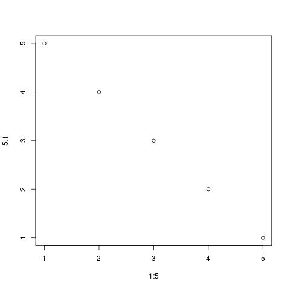

```{r setup, include=FALSE}
knitr::opts_chunk$set(echo = TRUE)
```

# Title for the first section {#section-id}

Add some words and citations [@ou2019] or use year only citation as [-@ou2019]

The figure can be cited as well (Figure \@ref(fig:tmpplot))

```{r tmpplot, fig.cap="This is the temporary figure", echo=FALSE}

```

# Reference
